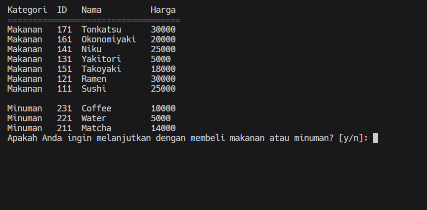

# Warung Kang Roger

Program ini adalah program untuk mendata pelanggan-pelanggan yang datang ke Warung Kang Roger.

## Compile Instruction
Jika pada komputer Anda telah terinstall makefile maka gunakan command tersebut pada command line
```
make
```
kemudian untuk menjalankan program jalankan command berikut
```
./app.exe
```

## Description

1. Tampilan Pertama, home screen dari view pemilik toko


2. Pemilik toko dapat memilih untuk membuka toko atau langsung menutup toko. Pilih angka 1 jika toko buka dan terdapat pelanggan.
3.  Jika Anda memilik angka 1, maka masukkan data-data yang diperlukan


4.  Pengguna atau pelanggan dapat memilih untuk melihat dan membeli menu atau keluar dari toko.


5. Pilih angka 1 untuk melihat menu. Berikut adalah tampilan menu

   

6. Inputkanlah karakter 'y' untuk memilih barang yang akan dibeli. Jika anda memilih 'n' maka akan kembali ke halaman yang disebutkan oleh point 4.
7. Anda bisa memilih berdasarkan nama barang atau ID dari barang tersebut

   

8. setelah pemilihan barang selesai, maka akan dibawa kembali ke halaman yang disebut oleh point 4.
9. Untuk keluar, pilihlah angka 2, "Keluar dari warung"

    

10. Program akan menampilkan barang-barang apa saja yang telah pengguna pilih

    

11. Tampilan layar akan kembali ke tampilan view oleh pemilik.
12. Jika pemilik memilih untuk menutup toko, maka akan ditampilkan rekap transaksi dan history pemesanan akan disimpan pada file output.txt.


