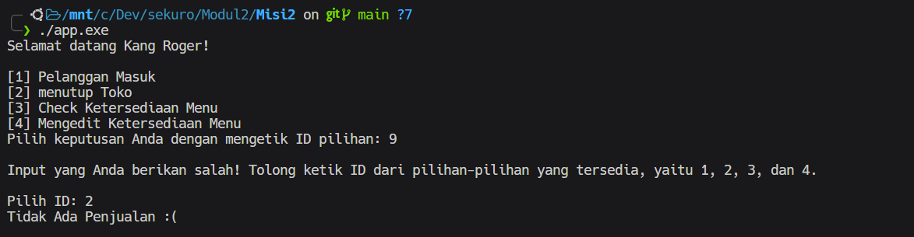

# Warung Kang Roger

## Detail-Detail yang Diperlukan

Untuk penyimpanan data makanan dan minuman, penulis mengambil keputusan untuk menyimpan data dalam bentuk *unordered_map*. Penulis memilih tipe data ini karena dalam tiap elemennya, terdapat data-data yang saling berkaitan.

<details><summary><b>Implementasi Unordered_map</b></summary>

```cpp
std::unordered_map<std::string, Menu> foodMenu;
foodMenu["Sushi"] = Menu{"Makanan", "Sushi", "111", 25000, 20};
foodMenu["Ramen"] = Menu{"Makanan", "Ramen", "121", 30000, 30};
foodMenu["Yakitori"] = Menu{"Makanan", "Yakitori", "131", 5000, 20};
foodMenu["Niku"] = Menu{"Makanan", "Niku", "141", 25000, 30};
foodMenu["Takoyaki"] = Menu{"Makanan", "Takoyaki", "151", 18000, 25};
foodMenu["Okonomiyaki"] = Menu{"Makanan", "Okonomiyaki", "161", 20000, 14};
foodMenu["Tonkatsu"] = Menu{"Makanan", "Tonkatsu", "171", 30000, 15};

std::unordered_map<std::string, Menu> drinkMenu;
drinkMenu["Matcha"] = Menu{"Minuman", "Matcha", "211", 14000, 20};
drinkMenu["Water"] = Menu{"Minuman", "Water", "221", 5000, 40};
drinkMenu["Coffee"] = Menu{"Minuman", "Coffee", "231", 10000, 20};

auto mapMenu = foodMenu;
mapMenu.insert(drinkMenu.begin(), drinkMenu.end());
```
</details>

<br>

Pada program ini terdapat data-data yang dapat dikelompokkan. Data-data yang berkaitan tersebut dikelompokkan degnan menggunakan struct. Berikut implementasinya

<details><summary><b>Implementasi Struct</b></summary>

```cpp
struct Menu
{
    std::string Kategori;
    std::string Nama;
    std::string ID;
    int Harga;
    int Stock;
};

struct Pelanggan
{
    std::string Nama;
    std::unordered_map<std::string, int> menuPilihan;
    std::unordered_map<std::string, Menu> summary;
};
```
</details>

<br>

## Fitur-Fitur Tambahan
Dalam menampilkan menu dan struk belanja, format console out dibuat dengan format tabel. Hal tersebut dapat dicapai dengan memanfaatkan library *iomanip*. Berikut adalah implementasinya

<details><summary><b>Implementasi Format Table</b></summary>

```cpp

void tampilkanStruk(std::unordered_map<std::string, Menu>& pilihanBelanja)
{
    std::cout << std::left;
    std::cout << std::setw(5) << "ID";
    std::cout << std::setw(14) << "Nama";
    std::cout << std::setw(8) << "Jumlah";
    std::cout << std::setw(9) << "Harga";
    std::cout << '\n';

    for (int i = 0; i < 35; ++i)
    {
        std::cout << "=";
    }
    std::cout << '\n';

    int totalTransaksi = 0;
    for (auto& [name, menu] : pilihanBelanja)
    {
        std::cout << std::setw(5) << menu.ID
                  << std::setw(14) << name
                  << std::setw(8) << menu.Stock
                  << std::setw(9) << menu.Harga
                  << std::endl;

        totalTransaksi += menu.Harga;
    }

    std::cout << "\nTotal Transaksi: Rp" << totalTransaksi << '\n';
}

void tampilkanMenu(std::unordered_map<std::string, Menu>& menuFood, std::unordered_map<std::string, Menu>& menuDrink)
{
    std::cout << std::left;
    std::cout << std::setw(10) << "Kategori";
    std::cout << std::setw(5) << "ID";
    std::cout << std::setw(14) << "Nama";
    std::cout << std::setw(8) << "Harga";
    // std::cout << std::setw(7) << "Stock";
    std::cout << std::endl;

    for (int i = 0; i < 35; ++i)
        std::cout << '=';
    std::cout << std::endl;

    for (auto& [name, menu] : menuFood)
    {
        std::cout << std::setw(10) << menu.Kategori;
        std::cout << std::setw(5) << menu.ID;
        std::cout << std::setw(14) << name;
        std::cout << std::setw(8) << menu.Harga;
        // std::cout << std::setw(7) << menu.Stock;
        std::cout << std::endl;
    }

    std::cout << '\n';
    for (auto& [name, menu] : menuDrink)
    {
        std::cout << std::setw(10) << menu.Kategori;
        std::cout << std::setw(5) << menu.ID;
        std::cout << std::setw(14) << name;
        std::cout << std::setw(8) << menu.Harga;
        // std::cout << std::setw(7) << menu.Stock;
        std::cout << std::endl;
    }
}
```
</details>

<br>

Dalam format tampilan di console, agar didapatkan tampilan yang rapih maka penulis membuat sebuah fungsi untuk membersihkan atau flushed isi text di console. Berikut adalah implementasinya

<details><summary><b>Implementasi Clear Console</b></summary>

```cpp
void clearScreen()
{
#if defined(__linux__) // Or #if __linux__
    system("clear");
#elif __APPLE__
    system("cls");
#elif _WIN32
    system("cls");
#endif
}
```
</details>

<br>

## Problems in Test Case
<details>
<summary><b>Input User Problem</b></summary>
Setiap menentukan pilihan, cara user memilih keputusan adalah dengan mengetik ID pilihan yang tersedia. Untuk meng-handle kasus user tidak memberikan pilihan yang benar maka dibuatlah function yang bernama "prosesKeputusan()" dengan parameter (1) input pilihan user, (2) Array berisi pilihan-pilihan ID yang valid, dan (3) besar Array pilihan-pilihan.

<br>

**Screenshot Hasil**



<br>

**Code**

```cpp
// Memvalidasi jawaban user -> Akan mengiterasi input user sampai pilihan user benar
int prosesKeputusan(int *usrInput, int *ptrArr, int sizeArr)
{
    if (std::cin.fail())
    {
        std::cin.clear();
        std::cin.ignore();
        *usrInput = -1;
    }

    bool salahInput = false;

    for (int i = 0; i < sizeArr; ++i)
    {
        if (*usrInput == *(ptrArr + i))
        {
            salahInput = true;
        }
    }

    if (salahInput)
    {
        return *usrInput;
    }
    else
    {
        std::cout << "\nInput yang Anda berikan salah! Tolong ketik ID dari pilihan-pilihan yang tersedia, yaitu ";
        bool flagTunggal = true;
        for (int i = 0; i < sizeArr - 1; ++i)
        {
            std::cout << *(ptrArr + i) << ", ";
            flagTunggal = false;
        }
        if (flagTunggal)
        {
            std::cout << *(ptrArr + sizeArr - 1) << ".\n\n";
        }
        else
        {
            std::cout << "dan " << *(ptrArr + sizeArr - 1) << ".\n\n";
        }

        int newUsrInput;
        std::cout << "Pilih ID: ";
        std::cin >> newUsrInput;

        return prosesKeputusan(&newUsrInput, ptrArr, sizeArr);
    }
}
```

</details>