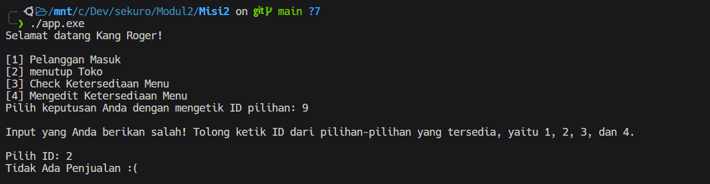

# Warung Kang Roger

## Table of Contents

## Problems in Test Case
<details>
<summary><b>Input User Problem</b></summary>
Setiap menentukan pilihan, cara user memilih keputusan adalah dengan mengetik ID pilihan yang tersedia. Untuk meng-handle kasus user tidak memberikan pilihan yang benar maka dibuatlah function yang bernama "prosesKeputusan()" dengan parameter (1) input pilihan user, (2) Array berisi pilihan-pilihan ID yang valid, dan (3) besar Array pilihan-pilihan.

<br>

**Screenshot Hasil**



<br>

**Code**

```cpp
// Memvalidasi jawaban user -> Akan mengiterasi input user sampai pilihan user benar
int prosesKeputusan(int *usrInput, int *ptrArr, int sizeArr)
{
    if (std::cin.fail())
    {
        std::cin.clear();
        std::cin.ignore();
        *usrInput = -1;
    }

    bool salahInput = false;

    for (int i = 0; i < sizeArr; ++i)
    {
        if (*usrInput == *(ptrArr + i))
        {
            salahInput = true;
        }
    }

    if (salahInput)
    {
        return *usrInput;
    }
    else
    {
        std::cout << "\nInput yang Anda berikan salah! Tolong ketik ID dari pilihan-pilihan yang tersedia, yaitu ";
        bool flagTunggal = true;
        for (int i = 0; i < sizeArr - 1; ++i)
        {
            std::cout << *(ptrArr + i) << ", ";
            flagTunggal = false;
        }
        if (flagTunggal)
        {
            std::cout << *(ptrArr + sizeArr - 1) << ".\n\n";
        }
        else
        {
            std::cout << "dan " << *(ptrArr + sizeArr - 1) << ".\n\n";
        }

        int newUsrInput;
        std::cout << "Pilih ID: ";
        std::cin >> newUsrInput;

        return prosesKeputusan(&newUsrInput, ptrArr, sizeArr);
    }
}
```

</details>